# Xcode Tips

## 프로젝트 파일 준비

### 1. Fork 버튼 클릭
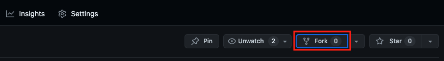

### 2. Fork Repository 생성
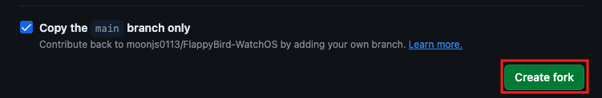

### 3. Fork한 Repository의 페이지에서 URL 복사
Fork된 Repository인지 확인하고 Code 메뉴에서 Clone URL을 복사
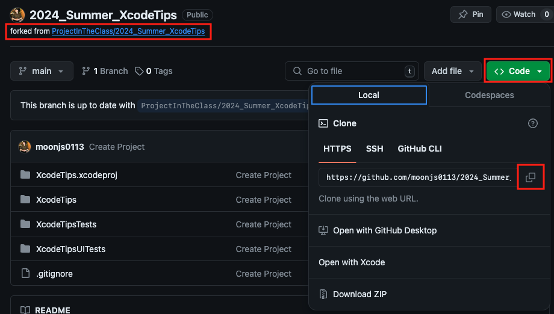

### 4. Terminal에서 Fork한 Repository를 Clone
터미널을 열고, `git clone 복사한URL` 명령어를 통해 Repository를 Clone
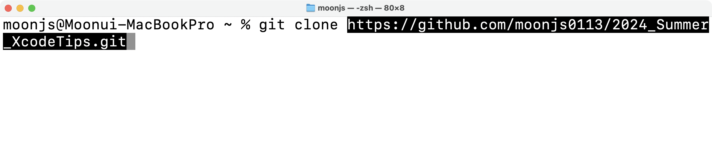

### 5. 자신의 닉네임으로 Branch를 생성하고, Push하기
아래 명령어를 차례대로 입력
``` shell
git checkout -b 자신의닉네임
git push origin 자신의닉네임
```


### 6. 다시 자신의 Repository 페이지에서 방금 Push한 Branch가 확인된다면 준비 완료!
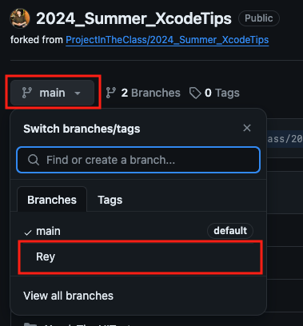

## Xcode 사용팁
- 주석 `⌘(command) + /`
- 커서 이동
    - `⌥(option)`+ 좌우 화살표: 단어 혹은 키워드 단위 이동
    - `⌘(command)`+ 좌우 화살표: 줄 맨 끝으로 이동
- Preview 단축키 : `⌥(option) + ⌘(command) + ⏎(return)`
- Multi Cursor : `⌃(control) + ⇧(shift)` + 원하는 위치 클릭
    - 화살표로 커서 이동시, 선택된 커서 전체 이동
- 괄호 접기: `⌥(option) + ⌘(command)` + 좌우 화살표
- 코드 정렬: `⌃(control) + i`
    - 주로 전체 블록 선택(`⌘(command) + a`)과 함께 사용
- Code Snippet
- `MARK`, `TODO`, `FIXME`, `!!!`, `???` 주석 라벨
- Docs 이동
    - `⌥(option)`+ 키워드 클릭: 공식 문서 Overview표시 및 이동
    - `⌘(command)`+ 키워드 클릭: 소스 선언부로 이동
- `⌘(command) + 0` → 1 ~ 7 네비게이터 단축키
- `⌥(option) + ⌘(command) + 0` → 1 ~ 6 유틸리티 단축키
- `⌘(command) + R` 실행
- `⌘(command) + .` 실행 중지

## 실습 자료 PR 올리기 - 반드시 실습 진행 후 진행
### 1. Terminal에서 `git add` 후 Commit 메세지 남기기
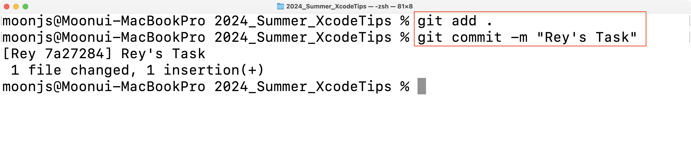

### 2. 자신의 Remote Repository에 Branch Push하기
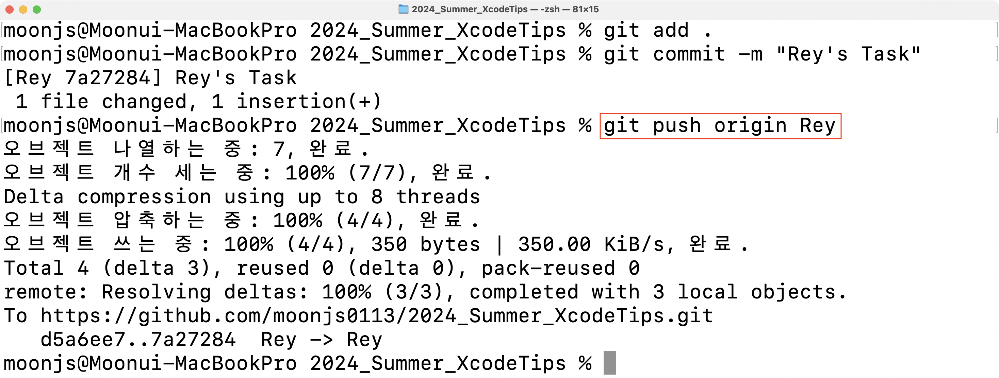
    
### 3. Repository에 페이지에서 내용 확인하기 
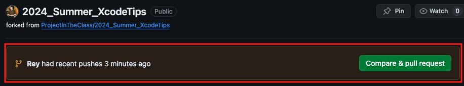

### 4. `Compare & pull request` 버튼 눌러서 Branch 선택하기
> 🚨주의🚨
>
> base repository는 **ProjectInTheclass/2024_Summer_XcodeTips의 `main` Branch** 선택하기
>
> head repository는 **본인의 2024_Summer_XcodeTips의 자신의 닉네임으로 된 Branch** 선택하기

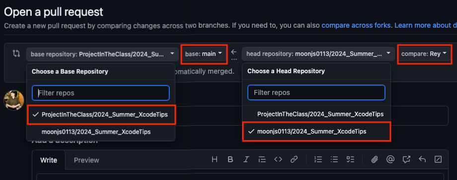
### 5. PR 내용 작성하기
내용 작성 후 `Create pull request` 클릭
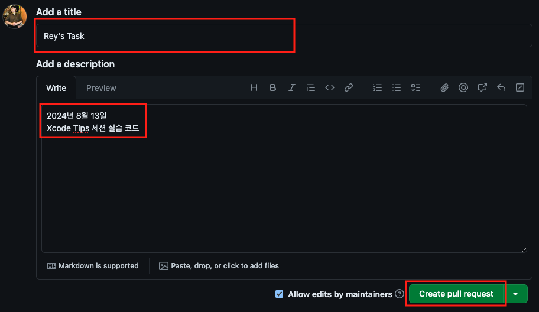

### 6. Assignees 추가하기
우측 Assignees 섹션의 `assign yourself` 클릭하기
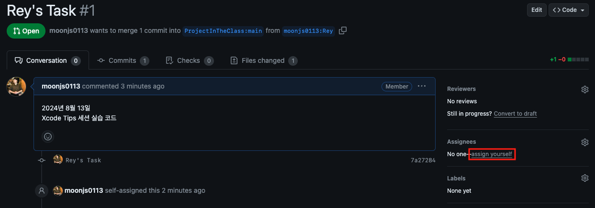

